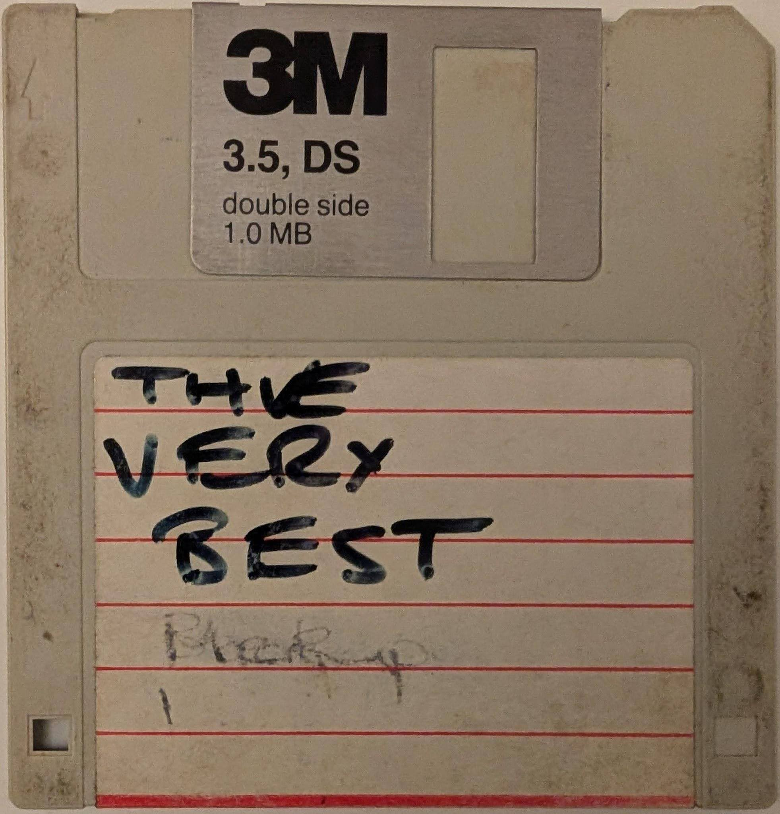

# Shifting Left, Shifting Right

## TODO Abstract

As we all shift right into the future, looking back we can see cycles of invention and re-invention of the activities that contribute to delivering software products.
Shifting left is used in a few contexts in slightly different ways but they broadly share the idea that defining things earlier in the workflow is an unalloyed good. This process can happen via code:- C++ 26 for example has a reflection proposal and other mechanisms have been used previously. For other ecosystems, it's "the air you breathe" and pervasive. This process can also happen via tooling, which affects the way we work and interact. As a final thought, this process occurs at the collaboration level and design level, which nudges the way we end up producing our total system, the finished product.

In this talk we'll go consider a variety of technologies and we'll be able to look back quite far in time. We can then cherry-pick some illustrative examples which will allow us to discuss how our understanding and attitudes of what to shift left and what to shift right have changed. Mostly importantly, what will we do next, and why?

## TODO Outline

Going back far enough, there are various strata. Strata where the dominant languages had almost no introspective capability, unless you rolled your own. There was an era of commercial software systems - some of which were pretty decent for defining software delivery pipelines. Dynamic languages waxed and waned and when in the ascendant, the distinction of whether a definition was cast in the code or part of the process became indistinct. J2EE, Ruby I'm looking at you. Languages with build systems would look jealously as systems where "it just worked". And I assert that in some important cases - these distinctions really mattered, and were not just aesthetic choices of languages.

![ABC][ABC]

## 1. A Personal Retrospective

### But first, some impersonal retrospectives

TODO done by human

### Systems

TODO done by human

### SCM

TODO done by human

## 4. Source Structure

TODO done by human

### Files

TODO done by human

### Databases

TODO done by human

### "Other"

TODO done by human

### "More Other"

TODO done by human

## 5. Deliverables

TODO done by human

### TODO "Delivery departments"

TODO done by human

### Via Floppy

### All in one

TODO done by human

### Databases

TODO done by human

### The processes

TODO done by human

## 6. Source Evolution

TODO done by human

### TODO

TODO done by human

### 7. Co-evolution of source changes

TODO done by human

### to boldy go

TODO done by human

### or not

TODO done by human

### one small setup

TODO done by human

### 8. Co-evolution of delivery mechanisms

![AnonFloppy]

### feature flags

TODO done by human

Beware SAT

[SAT]

### introspectable systems

TODO done by human

## Conclusion

TODO done by human

[ABC]: images/ABC.png
[floppy]: images/floppy.jpg
[AnonFloppy]: images/AnonFloppy.png
[DAG]: images/DAG.png
[DAG11]: images/DAG11.png
[DAG12]: images/DAG12.png
[DAG13]: images/DAG13.png
[DAG2]: images/DAG2.png
[DAG3]: images/DAG3.png
[DAG4]: images/DAG4.png
[DAG5]: images/DAG5.png
[DAG6]: images/DAG6.png
[DAG7]: images/DAG7.png
[DAG8]: images/DAG8.png
[DAG9]: images/DAG9.png
[DAGdag]: images/DAGdag.png
[skull]: images/skull.png
[YEARX]: images/YEARX.png
[YEARxx]: images/YEARxx.png
[YEARxxx]: images/YEARxxx.png
[YEARxxxx]: images/YEARxxxx.png
[YEARxxxxx]: images/YEARxxxxx.png
[SAT]: https://en.wikipedia.org/wiki/Boolean_satisfiability_problem
